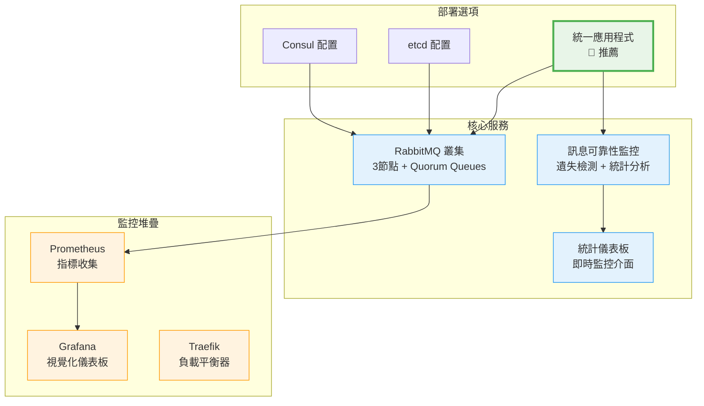
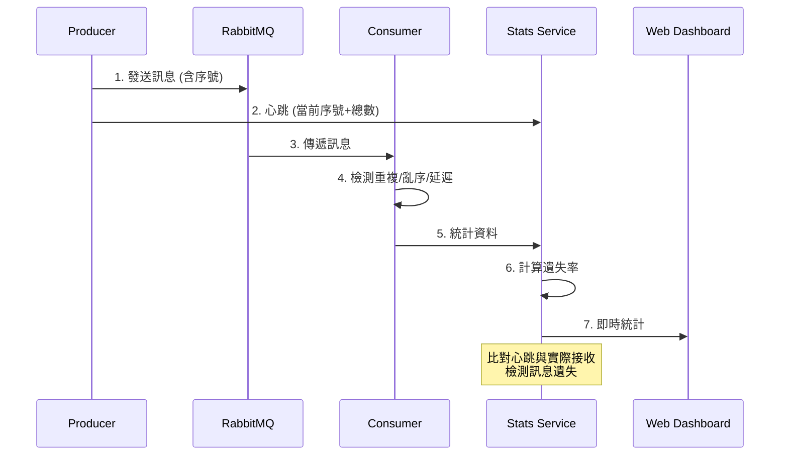

# RabbitMQ High Availability Testing Project

一個專為測試 RabbitMQ 高可用性設計的完整測試平台，提供訊息可靠性監控、故障恢復測試和效能分析。

## 🚀 專案特色

- **🐰 RabbitMQ 高可用性測試** - 支援 Consul 和 etcd 兩種服務發現機制
- **📊 訊息可靠性監控** - 內建遺失檢測、重複檢測、延遲分析
- **🌐 即時統計儀表板** - Web 介面展示即時可靠性指標
- **🔄 故障恢復測試** - 模擬節點故障、網路分區等場景
- **🐳 Docker Swarm 部署** - 完整的容器化部署解決方案
- **📈 監控整合** - Prometheus + Grafana 監控堆疊

## 📋 專案架構



## 📁 專案結構

```
rabbitmq-ha/
├── README.md                 # 專案說明
├── start.sh                  # 快速啟動腳本
├── stop.sh                   # 停止腳本
├── 
├── consul/                   # Consul 配置版本
│   ├── docker-compose.yml    # Docker Swarm 配置
│   ├── rabbitmq.conf        # RabbitMQ 配置
│   ├── prometheus.yml       # Prometheus 配置
│   └── grafana/             # Grafana 儀表板
│       ├── dashboards/      # 預設儀表板
│       └── provisioning/    # 自動配置
├── 
├── etcd/                     # etcd 配置版本
│   ├── docker-compose.yml    # Docker Swarm 配置
│   ├── rabbitmq.conf        # RabbitMQ 配置
│   ├── prometheus.yml       # Prometheus 配置
│   └── grafana/             # Grafana 儀表板 + etcd 專用
│
└── unified/                  # 🌟 統一應用程式 (推薦)
    ├── index.js             # 統一的 Producer/Consumer/Stats
    ├── package.json         # 依賴管理
    ├── Dockerfile           # 容器配置
    ├── docker-compose.yml   # 部署配置
    ├── build.sh             # 建置腳本
    ├── test-*.sh            # 測試腳本
    └── README.md            # 詳細使用說明
```

## 🌟 推薦使用：統一應用程式

**`unified/` 是推薦的使用方式**，提供單一 Docker 映像支援多種模式：

### 🎯 支援模式

- **`consumer`** - 純 Consumer 模式
- **`producer`** - 純 Producer 模式 + REST API
- **`both`** - 混合模式 (測試用)
- **`stats`** - 統計收集器 + Web 儀表板

### 🔍 訊息可靠性監控



### 📊 監控指標

| 指標 | 說明 | 警告閾值 |
|------|------|----------|
| **遺失率** | 未收到的訊息比例 | > 0.1% |
| **重複率** | 重複接收的訊息比例 | > 5% |
| **亂序率** | 亂序接收的訊息比例 | > 5% |
| **平均延遲** | 訊息傳輸延遲 | > 1000ms |

## 🚀 快速開始

### 1. 基本部署 (推薦)

```bash
# 啟動完整環境 (使用 Consul 配置)
./start.sh

# 訪問服務
open http://stats.swarm-test        # 統計儀表板
open http://producer.swarm-test     # Producer API
open http://rabbitmq.swarm-test     # RabbitMQ Management
open http://localhost:3000          # Grafana
```

### 2. 統一應用程式測試

```bash
cd unified

# 本地測試
npm install
./test-reliability.sh       # 可靠性測試
./test-stats-api.sh         # API 測試
./test-message-loss.sh      # 遺失檢測測試

# Docker 部署
./build.sh latest
docker stack deploy -c docker-compose.yml rabbitmq-ha
```

### 3. 特定配置部署

```bash
# 使用 etcd 配置
cd etcd && docker stack deploy -c docker-compose.yml rabbitmq-ha

# 使用 Consul 配置  
cd consul && docker stack deploy -c docker-compose.yml rabbitmq-ha
```

## 🌐 訪問端點

| 服務 | URL | 說明 |
|------|-----|------|
| **統計儀表板** | http://stats.swarm-test | 訊息可靠性監控 |
| **Producer API** | http://producer.swarm-test | 訊息發送 API |
| **RabbitMQ Management** | http://rabbitmq.swarm-test | RabbitMQ 管理介面 |
| **Grafana** | http://localhost:3000 | 系統監控儀表板 |
| **Prometheus** | http://localhost:3002 | 指標數據庫 |
| **Traefik Dashboard** | http://localhost:8080 | 負載平衡器狀態 |
| **Consul** | http://localhost:3001 | 服務發現 (僅 Consul 配置) |

**預設帳號**: admin / test1234 (RabbitMQ)

## 📊 監控和測試

### Grafana 儀表板

專案包含預設的 Grafana 儀表板：

- **RabbitMQ Overview** - RabbitMQ 叢集概覽
- **RabbitMQ Cluster** - 叢集詳細狀態  
- **Node Exporter** - 系統資源監控
- **Container Monitoring** - 容器狀態監控

### 測試場景

1. **基本功能測試**
   ```bash
   cd unified && ./test-reliability.sh
   ```

2. **故障恢復測試**
   ```bash
   # 停止一個 RabbitMQ 節點
   docker service scale rabbitmq-ha_rabbitmq=2
   
   # 觀察故障轉移
   open http://stats.swarm-test
   ```

3. **負載測試**
   ```bash
   # 擴展服務
   docker service scale rabbitmq-ha_producer=10
   docker service scale rabbitmq-ha_consumer=10
   ```

4. **訊息遺失測試**
   ```bash
   cd unified && ./test-message-loss.sh
   ```

## 🔧 配置選項

### 環境變數

| 變數 | 預設值 | 說明 |
|------|--------|------|
| `MODE` | `consumer` | 應用模式: consumer/producer/both/stats |
| `RABBITMQ_URL` | - | RabbitMQ 連接字串 (支援多主機) |
| `HEARTBEAT_INTERVAL` | `10000` | Producer 心跳間隔 (毫秒) |
| `STATS_REPORT_INTERVAL` | `30000` | 統計報告間隔 (毫秒) |
| `AUTO_SEND` | `false` | 自動發送測試訊息 |

### Docker Swarm 配置

```yaml
# 服務擴展
docker service scale rabbitmq-ha_consumer=5
docker service scale rabbitmq-ha_producer=3
docker service scale rabbitmq-ha_rabbitmq=3

# 資源限制
resources:
  limits:
    memory: 512M
    cpus: "0.5"
```

## 🚨 故障排除

### 常見問題

1. **檢查服務狀態**
   ```bash
   docker service ls
   docker service logs -f rabbitmq-ha_rabbitmq
   docker service logs -f rabbitmq-ha_stats
   ```

2. **檢查叢集狀態**
   ```bash
   # RabbitMQ 叢集狀態
   docker exec -it $(docker ps -q -f name=rabbitmq-ha_rabbitmq) rabbitmqctl cluster_status
   
   # 服務發現 (Consul)
   curl http://localhost:3001/v1/catalog/service/rabbitmq
   ```

3. **重建環境**
   ```bash
   ./stop.sh
   docker system prune -f
   ./start.sh
   ```

### 性能調優

- **增加 Consumer 數量**：提高訊息處理能力
- **調整心跳間隔**：平衡監控精度和網路負載
- **配置資源限制**：避免資源競爭
- **使用 SSD 儲存**：提高 RabbitMQ 性能

## 🎯 架構對比

| 配置 | 服務發現 | 特色 | 適用場景 |
|------|----------|------|----------|
| **consul** | Consul | 自動治癒、服務註冊 | 生產環境、大規模部署 |
| **etcd** | etcd | 分散式一致性 | 需要強一致性的場景 |
| **unified** | 無 | 可靠性監控、測試工具 | 測試、驗證、監控 |

## 🔄 持續改進

### 已實現功能 ✅

- ✅ 訊息序號追蹤和遺失檢測
- ✅ 即時統計儀表板  
- ✅ Producer 心跳機制
- ✅ 多模式統一應用程式
- ✅ Docker Swarm 部署
- ✅ Grafana 監控儀表板

### 未來計劃 📋

- [ ] 死信佇列處理
- [ ] 訊息優先級測試
- [ ] 延遲訊息功能
- [ ] Kubernetes 部署配置
- [ ] 自動化壓力測試
- [ ] 更多服務發現選項

## 🤝 貢獻

歡迎提交 Issue 和 Pull Request！請查看各個目錄的 README 了解詳細說明。

## 📄 授權

ISC License

---

🎉 **開始你的 RabbitMQ 高可用性測試之旅吧！**